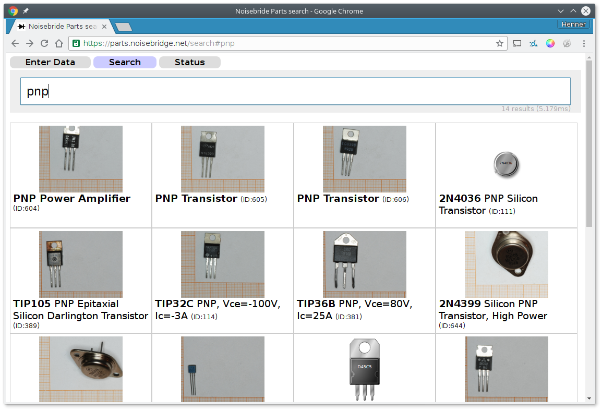
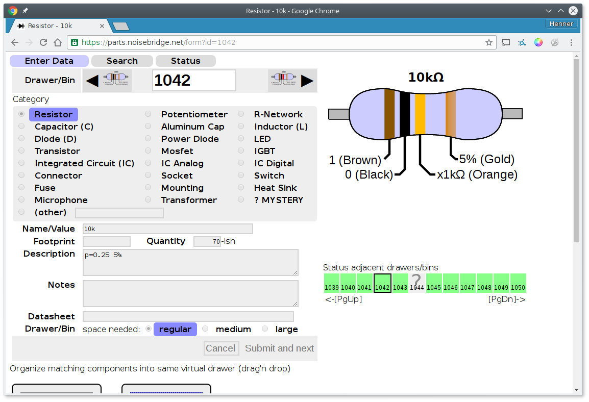

Keeping track of stuff
----------------------

Mostly to organize electronic components at home and at hackerspace. Store
details in a database and make them findable with a pleasing fast search.

We use it at Noisebridge: https://parts.noisebridge.net

Uses SQLite to keep data in one file, so you need this external go dependency

```
go get github.com/mattn/go-sqlite3
```

Other than that, no external dependency is needed.

### Features
(work in progress of course)

- Enter form to enter details found in boxes with a given ID. Assumes that
  all your items are labelled with a unique number.
- Search form with search-as-you-type in an legitimate use of JSON ui :)
- Automatic synonym search (e.g. query for `.1u` is automatically re-written to `(.1u | 100n)`)
- Boolean expressions in search terms.
- A search API returning JSON results to be queried from other
  applications.
- A way to display component pictures (and soon: upload). Also automatically
  generates some drawing if there is a template for the package name, or if
  it is a resistor, auto-generates an image with resistor color bands.
- Drag'n drop arrangement of similar components that should
  be in the same drawer. We have a large amount of different donations that
  all have overlapping set of parts. This helps organize these.
- An extremely simple 'authentication' by IP address. By default, within the
  Hackerspace, the items are editable, while externally, a readonly view is
  presented (this will soon be augmented with OAuth, so that we can authenticate
  via a login of our wiki).

Search                     | Detail Page with resistor
---------------------------|-------------------------------|
   |

## API

Next to a web-UI, this provides as well a search API with JSON response
to be integrated in other apps, e.g. slack

### Sample query
```
https://parts.noisebridge.net/api/search?q=fet
```

Optional URL-parameter `count=42` to limit the number of results (default: 100).

### Sample response
```json
{
  "link": "/search#fet",
  "components": [
    {
      "id": 42,
      "equiv_set": 42,
      "value": "BUK9Y16-60E",
      "category": "Mosfet",
      "description": "Mosfet N-channel, 60V, 53A, 12.1mOhm\nSOT669",
      "quantity": "25",
      "notes": "",
      "datasheet_url": "http://www.nxp.com/documents/data_sheet/BUK9Y15-60E.pdf",
      "footprint": "LFPAK56",
      "img": "/img/42"
    },
    {
      "id": 76,
      "equiv_set": 76,
      "value": "BUK9Y4R4-40E",
      "category": "Mosfet",
      "description": "N-Channel MOSFET, 40V, 4.4mOhm@5V, 3.7mOhm@10V",
      "quantity": "4",
      "notes": "",
      "datasheet_url": "http://www.nxp.com/documents/data_sheet/BUK9Y4R4-40E.pdf",
      "footprint": "LFPAK56",
      "img": "/img/76"
    }
  ]
}
```

### Note

Beware, these are also my early experiments with golang and it only uses basic
functionality that comes with the stock library: HTTP server and templates.
It doesn't use a web framework of any kind, only what comes with the
golang libraries. And it might not necessarily be pretty as I am learning.

HTML, CSS and JavaScript is hand-written and not generated - I want to keep it
that way as long as possible to get a feeling of what would need to be done for
a web framework (but be aware that my last exposure to HTML was around 1997,
before there was CSS and working JavaScript ... so if you find something that
should be stylistically better, let me know).

When the HTML output is not burried under various layers of abstractions it is
also easier to understand what parts in web-browsers are slow
and address them directly. So no dependency on golang web-frameworks or JQuery
of stuff like that. Less dependencies are good.
