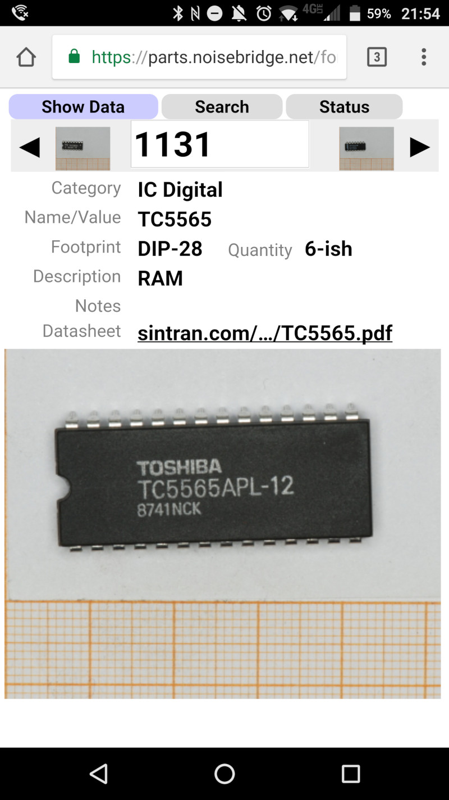

Keeping track of stuff
----------------------

Mostly to organize electronic components at home and at hackerspace. Store
details in a database and make them findable with a pleasing fast search.

We use it at Noisebridge: https://parts.noisebridge.net/

If this is the first time you are using go, you might need to set up
the `GOPATH` environment variable; please refer to golang documentation.

Uses SQLite to keep data in one file, so you need this external go dependency

```
go get github.com/mattn/go-sqlite3
```

For users with Go version < 1.7 This go-sqlite3 dependency uses 'context' which
was built into go after golang v1.7. So, if you are using Go version < 1.7 (say
on a raspberry pi or beaglebone black), then install the go context package,
 and you will need to modify something something in the go-sqlite3 and install the external packages 

```
go get x/net/context package
```

Other than that, no external dependencies are needed.

To run the app navigate to the [stuff/](./stuff) directory and run:
```
make stuff
./stuff
```

You can then open it at http://localhost:2000/ to start adding stuff to
your database.

These are the available options for the binary
```
Usage of ./stuff:
  -cache-templates
        Cache templates. False for online editing while development. (default true)
  -cleanup-db
        Cleanup run of database
  -dbfile string
        SQLite database file (default "stuff-database.db")
  -edit-permission-nets string
        Comma separated list of networks (CIDR format IP-Addr/network) that are allowed to edit content
  -imagedir string
        Directory with component images (default "img-srv")
  -logfile string
        Logfile to write interesting events
  -port int
        Port to serve from (default 2000)
  -site-name string
        Site-name, in particular needed for SSL
  -ssl-cert string
        Cert file
  -ssl-key string
        Key file
  -staticdir string
        Directory with static resources (default "static")
  -templatedir string
        Base-Directory with templates (default "./template")
  -want-timings
        Print processing timings.
```

There is a demo database in the [db/](./db) directory (which really
is just a backup of the Noisebridge database). So you can play around by
copying `db/sqlite-file.db` to `stuff-database.db` and play right away.

Let's try this:
```
cp ../db/sqlite-file.db stuff-database.db
./stuff -dbfile stuff-database.db
```

There are no images in this repository for demo; for your set-up, you can
take pictures of your components and drop in some directory. If there is
no image, some are generated from the type of component (e.g. capacitor or
diode), and some color-coding image even generated from the value of a
resistor.

To show your own component images, you need to point the `-imagedir` flag
to a directory that has images with name `<component-id>.jpg`.
So for bin 42, this would be `42.jpg`.

By default, you can edit database from any IP address, but
with `-edit-permission-nets`, you can give an IP address range that is allowed
to edit, while others only see a read-only view. The readonly view also has
the nice property that it is concise and looks good on mobile devices.

If you give it a key and cert PEM via the `--ssl-key` and `--ssl-cert` options,
this will start an HTTPS server (which also understands HTTP/2.0).

### Features
(work in progress of course)

- Enter form to enter details found in boxes with a given ID. Assumes that
  all your items are labelled with a unique number.
- Search form with search-as-you-type in an legitimate use of JSON ui :)
- Automatic synonym search (e.g. query for `.1u` is automatically re-written to `(.1u | 100n)`)
- Boolean expressions in search terms.
- A search API returning JSON results to be queried from other
  applications.
- A way to display component pictures (and soon: upload). Also automatically
  generates some drawing if there is a template for the package name, or if
  it is a resistor, auto-generates an image with resistor color bands.
- Drag'n drop arrangement of similar components that should
  be in the same drawer. We have a large amount of different donations that
  all have overlapping set of parts. This helps organize these.
- An extremely simple 'authentication' by IP address. By default, within the
  Hackerspace, the items are editable, while externally, a readonly view is
  presented (this will soon be augmented with OAuth, so that we can authenticate
  via a login of our wiki).

Search                     | Detail Page with resistor     | Mobile view
---------------------------|-------------------------------|--------------
   |     | 

## API

Next to a web-UI, this provides as well a search API with JSON response
to be integrated in other apps, e.g. slack

### Sample query
```
https://parts.noisebridge.net/api/search?q=fet
```

Optional URL-parameter `count=42` to limit the number of results (default: 100).

### Sample response
```json
{
  "link": "/search#fet",
  "components": [
    {
      "id": 42,
      "equiv_set": 42,
      "value": "BUK9Y16-60E",
      "category": "Mosfet",
      "description": "Mosfet N-channel, 60V, 53A, 12.1mOhm\nSOT669",
      "quantity": "25",
      "notes": "",
      "datasheet_url": "http://www.nxp.com/documents/data_sheet/BUK9Y15-60E.pdf",
      "footprint": "LFPAK56",
      "img": "/img/42"
    },
    {
      "id": 76,
      "equiv_set": 76,
      "value": "BUK9Y4R4-40E",
      "category": "Mosfet",
      "description": "N-Channel MOSFET, 40V, 4.4mOhm@5V, 3.7mOhm@10V",
      "quantity": "4",
      "notes": "",
      "datasheet_url": "http://www.nxp.com/documents/data_sheet/BUK9Y4R4-40E.pdf",
      "footprint": "LFPAK56",
      "img": "/img/76"
    }
  ]
}
```

### Note

Beware, these are also my early experiments with golang and it only uses basic
functionality that comes with the stock library: HTTP server and templates.
It doesn't use a web framework of any kind, only what comes with the
golang libraries. And it might not necessarily be pretty as I am learning.

HTML, CSS and JavaScript is hand-written and not generated - I want to keep it
that way as long as possible to get a feeling of what would need to be done for
a web framework (but be aware that my last exposure to HTML was around 1997,
before there was CSS and working JavaScript ... so if you find something that
should be stylistically better, let me know).

When the HTML output is not burried under various layers of abstractions it is
also easier to understand what parts in web-browsers are slow
and address them directly. So no dependency on golang web-frameworks or JQuery
of stuff like that. Less dependencies are good.
